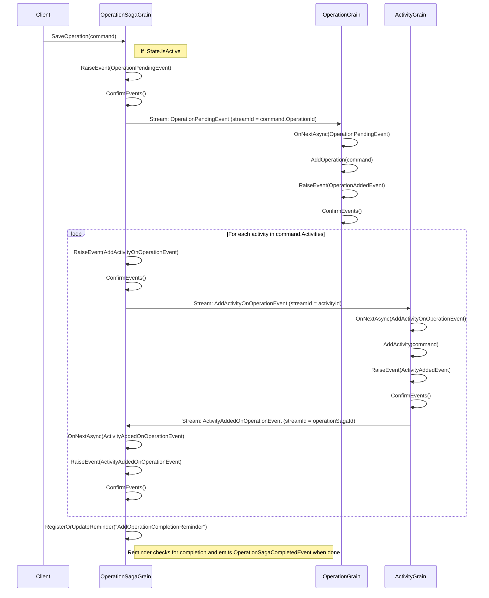

```mermaid
sequenceDiagram
    participant Client
    participant OperationSagaGrain
    participant OperationGrain
    participant ActivityGrain

    Client->>OperationSagaGrain: SaveOperation(command)
    Note right of OperationSagaGrain: If !State.IsActive

    OperationSagaGrain->>OperationSagaGrain: RaiseEvent(OperationPendingEvent)
    OperationSagaGrain->>OperationSagaGrain: ConfirmEvents()
    OperationSagaGrain->>OperationGrain: Stream: OperationPendingEvent (streamId = command.OperationId)

    OperationGrain->>OperationGrain: OnNextAsync(OperationPendingEvent)
    OperationGrain->>OperationGrain: AddOperation(command)
    OperationGrain->>OperationGrain: RaiseEvent(OperationAddedEvent)
    OperationGrain->>OperationGrain: ConfirmEvents()

    loop For each activity in command.Activities
        OperationSagaGrain->>OperationSagaGrain: RaiseEvent(AddActivityOnOperationEvent)
        OperationSagaGrain->>OperationSagaGrain: ConfirmEvents()
        OperationSagaGrain->>ActivityGrain: Stream: AddActivityOnOperationEvent (streamId = activityId)
        ActivityGrain->>ActivityGrain: OnNextAsync(AddActivityOnOperationEvent)
        ActivityGrain->>ActivityGrain: AddActivity(command)
        ActivityGrain->>ActivityGrain: RaiseEvent(ActivityAddedEvent)
        ActivityGrain->>ActivityGrain: ConfirmEvents()
        ActivityGrain->>OperationSagaGrain: Stream: ActivityAddedOnOperationEvent (streamId = operationSagaId)
        OperationSagaGrain->>OperationSagaGrain: OnNextAsync(ActivityAddedOnOperationEvent)
        OperationSagaGrain->>OperationSagaGrain: RaiseEvent(ActivityAddedOnOperationEvent)
        OperationSagaGrain->>OperationSagaGrain: ConfirmEvents()
    end

    OperationSagaGrain->>OperationSagaGrain: RegisterOrUpdateReminder("AddOperationCompletionReminder")
    Note right of OperationSagaGrain: Reminder checks for completion and emits OperationSagaCompletedEvent when done
```